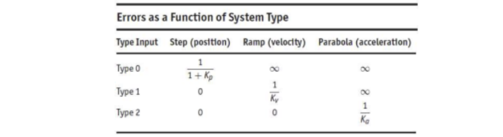
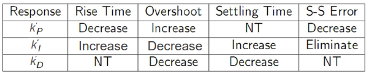

# AER372 Control Systems
Final review. Not intended to be a complete set of class notes. Also very lazy writing.     

## Dynamic System Response
### Laplace and Transfer Function
The unilateral Laplace transform given by 
$$ F(s) \equiv \mathcal{L}[f(t)] =  \int_{0}^{\infty} f(t) e^{-st}dt$$
* Some [properties](Laplace transform - Wikipedia.mhtml)
* List of [common transforms](List of Laplace transforms - Wikipedia.mhtml)

Defined as the ratio of the laplace transform of the output signal to that of the input signal, assuming that the system is at equilibrium initially. Let $H(s)$ be the transfer function, then the **DC Gain** is 
$$\text{DC Gain} = \lim_{s\to 0} H(s)$$
### First-order System Response
Transfer function is in the form
$$ H(s) = \frac{b}{s+a}$$
This has a time constant of $T = \frac{1}{a}$ such that  
$$\begin{align}
y_{step}(T) &= 0.63\frac{b}{a} \\\\
y_{impulse}(T) &= 0.37 b
\end{align}$$
For a step input, the steady state value is $y_{ss} = \frac{b}{a}$ which corresponds to a rise time and settling time of 
$$t_r \approx \frac{2.2}{a}, \qquad t_s \approx \frac{4.6}{a}$$
where rise time is the time to go from $0.1y_{ss}\to 0.9y_{ss}$ and the settling time satisfies $y_{step}(t_s)=0.99y_{ss}.$ There is no overshoot, and no oscillations.
### Second-order System Response
A second-order system can be written as
$$H(s) = \frac{\omega_n^2}{s^2+2\zeta\omega_n s + \omega_n^2} = \frac{\sigma^2 + \omega_d^2}{(s+\sigma)^2 + \omega_d^2}$$
A second order system has a DC gain of \(1\) and a peak time of 
$$t_p = \frac{\pi}{\omega_n\sqrt{1-\zeta^2}} = \frac{\pi}{\omega_d}$$
and an overshoot of 
$$M_p = e^{-\pi \zeta/\sqrt{1-\zeta^2}}.$$
As *approximations* a typical design relation requires $\zeta = 0.5$ and $e^{-\zeta\omega_n t_s} \approx 0.1$ which gives 
$$t_r \approx \frac{1.8}{\omega_n},\qquad t_s \approx \frac{4.6}{\sigma}$$
What are the **effects of zeros?** If there is a zero, we can put the transfer function in the form 
$$H(s) = \frac{\frac{1}{\alpha\zeta}s+1}{s^2+2\zeta s + 1}$$
* Results in a shorter rise and peak time, but larger overshoot.
* The larger $\alpha$ is, the further the (real) zero is from the poles, $\implies$ smaller effect on the transient response.
* If a zero is sufficiently close to a pole, it tends to *neutralize* the effect.
* A real zero in the LHP will notably increase overshoot if the zero is within **a factor of 4** of the real part of the complex poles
* A real zero in the RHP will reduce the overshoot (but may cause the step response to start out in a wrong direction)
### Higher-order System Response
* In general, the major effect of additional poles (with a negative real value) is to increase the system rise time (and decrease overshoot)
* They slow down transient response, but has little effect on settling time
* An additional real pole in the LHP will notably increase rise time (but decrease the overshoot) if the extra pole is within a **factor of 4** of the real part of the complex poles.

In general, the time constant is given by
$$T = \left|\frac{1}{\sigma}\right|$$
where $\sigma$ is the real part of the pole, and the imaginary part of the pole, $\omega_d$ determines the damped frequency. The magnitude of the pole determines the natural frequency and the argument of the pole determines the damping ratio. We can compute
$$\zeta = \sin(\theta)$$
with the convention that the point $1+0j$ has an angle of $\theta=0.$ 
### Stability of LTI Systems
Very concise discussion [here](/stability.pdf)

Key words:
* Bounded-Input-Bounded-Output (BIBO) Stability
* Asymptotic Stability
* Routh's (Routh-Hurwitz) Stability Criterion

## Feedback Control System Analysis
### Stability
Consider an **open-loop** transfer function in the form of
$$T_{ol}(s) = \frac{b(s)c(s)}{a(s)d(s)}$$
Recall that we cannot have $a(s)$ or $d(s)$ to have roots in the RHP. It is **impractical** to cancel these roots with the numerator (which are affected by the controller)
However, it is possible to perform root cancellation for **open-loop** transfer functions.
### Tracking
Tracking is the ability of the control system to make the output follow reference input as closely as possible. 
* If the plant is *stable* AND has *no zeros in the RHP*, then the open-loop controller can be selected to "cancel" the plant transfer function and replace it with a desired one, with the following conditions:
  * Transfer function must be proper
  * Controller cannot cause too fast a response past the plant actuation limit
  * Cancelling plant's stable poles that are very close to imaginary axis may turn the system too sensitive and cause unacceptable transients

If we have a closed-loop control, then we can do the same thing, but have more freedom (i.e. pole-zero placement)

We assume reference input $R$ is a polynomial

$$r(t) = Ct^k 1(t)$$

@@DEF
The **type** of a (closed-loop) control system with respect to tracking is defined as the degree of the polynomial reference input that the system can reasonably track (i.. with constant error)
@@
@@THM
The type of a feedback system depends on the number of poles that its open-loop transfer function $GD_{cl}$ has at the origin. If we have
$$GD_{cl} = \frac{b(s)}{s^ka(s)}$$
Then, the system is of type $k.$
@@

We can define $K_i = \lim_{s\to 0} s^k GD_{cl}(s)$ so $K_p,K_v,K_a = K_0,K_1,K_2.$ 



### Regulation
The ability of the control system to keep the error (difference between output and reference input) small when the reference input is at most a constant setpoint and disturbance and noise are present

**Open-loop Control:** Controller has no influence on the output with respect to disturbance and noise

**Closed-Loop Control** LEt the input by $R(s)$ and output be $Y_{cl}(s).$ We can define 
$$E_{cl} = R-Y_{cl} = (1-\mathcal{T})R - G \mathcal{S}W + H\mathcal{T}V$$
where $W$ is the disturbance added between controller and plant, and $V$ is noise added to the sensor. For a closed negative feedback system with controller $D_{cl}(s)$, plant $G(s)$, and sensor $H(s)$, we have 
$$E_{cl} = \frac{1+GD_{cl}(H-1)}{1+HGD_{cl}}R - \frac{G}{1+HGD_{cl}}W + \frac{HGD_{cl}}{1+HGD_{cl}}V$$
To make the effect of $W$ small, make $D_{cl}$ as large as possible, but this also causes sensor noise to increase. To solve this, design $D_{cl}$ to hav large values at low frequencies (where plant disturbance appears) and small values at high frequencies (where sensory noise shows up).

One way to analyze this is to set $R=V=0$ and consider the transfer function
$$T_w(s) = \frac{Y(s)}{W(s)}$$
### Sensitivity
Define the **sensitivity** of a transfer function $T$ to a plant gain $G$ as 
$$\mathcal{S}^T_G = \frac{G}{T} \frac{\delta T}{\delta G}$$
**Open-loop Control:** Sensitivity is $1$

**Closed-loop Control:** The sensitivity is given by the *sensitivity transfer function*

$$\mathcal{S}^{T_{cl}}_G = \frac{1}{1+HGD_{cl}}$$
The controller $D_{cl}$ can be designed such that sensitivity is significantly less than $1.$

### PID Control System
PID Controller in the form of
$$k_P + \frac{k_I}{s} + sk_D$$

* **Proportional Control:** increasing $k_P$ can cause the steady state error to be reduced (but not removed) and speed of response increased, but response damping will also be decreased resulting in higher overshoots
* **Integral Control:** Steady state tracking (and regulation) errors to constant input (and disturbance) will always be zero. Robust against plant variations (i.e. sensitivity is zero). However, system can be slower. For stability, we need
$$ k_I < \frac{2\zeta\omega_n}{K}$$
* **Derivative Control:** May increase steady-state error, but can reduce the overshoot and improve stability. It can also speed up transient response, but in practice, it always amplifies the noise.
* **PI Control** Steady state tracking errors to constant input are zero. Can behave like a second-order system by stable pole cancellation. Generally allows for a faster response than a pure integral controllre. For stability,
$$ k_I < \frac{2\zeta\omega_n(1+k_PK)}{K}$$
* **PID Control** Very good. For stability,
$$k_I < \frac{(2\zeta+k_DK\omega_n)(1+k_PK)\omega_n}{K}$$

### PID Gain Tuning (General Rules)

1. Determine what characteristic of the system response needs to be improved
2. Use $k_P$ to decrease rise time
3. Use $k_D$ to reduce the overshoot and settling time
4. Use $k_I$ to eliminate steady-state error (be careful about system stability)



### Ziegler-Nichols Gain Tuning
**Method 1: Step Response**
This is applicable to plants without integrators and dominant complex poles, with a behaviour approximately represented by the following transfer function:
$$\frac{Y(s)}{U(s)} = \frac{As^{-t_ds}}{\tau s + 1}$$
Step response exhibits an S-shaped profile called **process reaction curve** characterized by lag $L=t_d,$ time constant $\tau,$ and a slope $R=A/\tau.$ If we want to design a PID controller with a 25% decay ratio (i.e. $\zeta\approx 21\%$) in the form of
$$D_{cl}(s) = k_p\left(1+ \frac{1}{T_Is} + T_Ds\right)$$
we want to choose
$$(k_P,T_I,T_D) = (1.2/RL, 2L, 0.5L)$$
and for PI,
$$(k_P,T_I) = ( 0.9/RL, L/0.3)$$
and for P,
$$k_P = 1/RL$$

**Method 2: Ultimate Sensitivity**

1. Start with a closed-loop controller with only a proportional gain $k_P$
2. Begin with a low value of $k_P$ and gradually increase it until the onset of a stead-state oscillation is achieved. The proportional gain $K_u$ for such a response is called **ultimate gain** and the period of such an oscillation $P_u$ is called **ultimate period.**
3. Determine the proper PID control gains given by
$$(k_P,T_I,T_D) = (1.6K_u, 0.5P_u, 0.125P_u)$$
or for PI
$$(k_P,T_I = 0.45K_u, P_u/1.2)$$
or for P
$$k_P=0.5K_u$$

For **both** methods, the gain $k_P$ can usually be reduced (around 50\%) after tuning to reduce response oscillations.

## Root Locus Method
### Root Locus (Evans) Form
Given a transfer function
$$\frac{D_c(s)G(s)}{1+D_c(s)G(s)H(s)}$$
we can write the denominator as
$$a(s) + Kb(s) = 0$$
The Root Locus (Evans) Form is if we can manipulate this into the form
$$1 + KL(s) = 0$$
and giving $L(s)$ to MATLAB will give us the root locus for the original transfer function.
@@DEF
The root locus is the set of all possible values of $s$ for which the characteristic equation $1+KL(s)=0$ holds, as the real parameter $K$ varies from $0$ to $\infty.$ This is typically for the closed-loop system, so the roots are the system poles.
@@
An equivalent definition,
@@DEF
The root locus is the set of points in the $s$-plane where the phase of $L(s)$ is $180^\circ$ for positive locus, or $0^\circ$ for negative locus.
@@
### Visualization
```matlab
% Clear workspace and command window
clear;clc;

numerator_coefficients = [1 0];
denominator_coefficients = [1 0 1];

% Create the transfer function
G = tf(numerator_coefficients, denominator_coefficients);

% Plot the root locus
figure;
rlocus(G);
title('Root Locus Plot');
xlabel('Real Part');
ylabel('Imaginary Part');
grid on;
```
The diagonal lines represent $\cos\theta$ and the $K$ value associated with the poles can be found using
```matlab
rlocfind(G)
```
in the terminal.

### Positive Root Locus Rules
1. There are $n$ branches of the locus starting at the poles of $L(s)$ (open-loop poles) and $m$ ($\le n$) of these branches end at the zeros of $L(s)$ (open-loop zeros), and the rest goes to infinity.
2. The segments of the locus on the real axis are always to the left of an odd number of real poles and zeros.
3. If $n>m$ when $K\to\infty$ those $n-m$ branches that must go to infinity are asymptotic to lines radiating out from real axis at the points $s=\alpha$ at angles $\phi_l$ where
$$\alpha = \frac{\sum p_i - \sum z_i}{n-m}$$
$$\phi_l = \frac{180^\circ + 360^\circ(l-1)}{n-m}$$
for $l=1,2,\dots,n-m.$ Here, the angle is calculated normally (i.e. $\phi=0$ corresponds to $1+0j$).
4. The angle of departure of a branch of the locus from a single pole is identified by
$$\phi_{dep} = \sum \psi_i - \sum_{i\neq dep} - 180^\circ$$
where $\sum \psi_i$ is the sum of the angles from all zeros to the single pole and $\sum \phi_i$ is the sum of angles from all remaining poles to the single pole. The angle of arrival of a branch at a zero is obtained by
$$\psi_{arr} = \sum \phi_i - \sum_{i\neq arr} \psi_i + 180^\circ.$$
where $\sum \phi_i$ is the sum of the angles from zero to all the poles and $\sum \psi_i$ is the sum of the angles from the zero to the other zeros. Note that if there is multiplicity, it's slightly complicated. See page 13 of Chapter 5 Part 1 for more information.
5. There can be multiple roots (of the characteristic polynomial) at points on the locus, and branches depart (or approach) from a point of $q$ roots at angles separated by
$$\frac{180^\circ+360^\circ(l-1)}{q}$$
for $l=1,2,\dots,q.$ This forms an array of $2q$ rays that are equally spaced. If this point is on the real axis, note that phase angles of conjugate poles/zeros cancel each other.

6. Breakaway-break-in points (points where two or more branches meet and break away) are among the roots of 
$$\frac{dL(s)}{ds}=0$$
### Design for Dynamic Compensation
Chapter 5 Part 3.
* Lead Compensation
* Lag Compensation
* Notch Compensation

## Frequency Response
If $u(t)=A\sin(\omega_0t)1(t)$ is the input, the steady state output is
$$y_{ss}(t) = A|G(j\omega_0)|\sin(\omega_0t+\angle G(j\omega_0))$$
### Lead Compensator
Lead Compensator: $\alpha < 1$
$$D_c(s) = \frac{Ts+1}{\alpha Ts + 1}$$

The following can be input into offline Desmos. The magnitude:
```
f(x)=\frac{\sqrt{\left(1+\alpha T^{2}x^{2}\right)^{2}+\left(1-\alpha\right)^{2}T^{2}x^{2}}}{\left(\alpha Tx\right)^{2}+1}
```
The angle:
```
g(x)=\arctan\left(Tx\right)-\arctan\left(\alpha Tx\right)
```
Make sure when plotting the magnitude and phase, do it on a log scale! For example, $f(10^x)$ and $g(10^x).$ We have the following relationships:
$$\omega_{max}=\frac{1}{T_D\sqrt{\alpha}}$$
$$\phi_\text{max} = \tan^{-1}\left(\frac{1}{\sqrt{\alpha}}\right) - \tan^{-1}(\sqrt{\alpha})$$
$$\sin\phi_\text{max} = \frac{1-\alpha}{1+\alpha} \implies \alpha = \frac{1-\sin\phi_\text{max}}{1+\sin\phi_\text{max}}$$
### Lag Compensator
Lag Compensator
$$D_c(s) = \beta \frac{T_Is+1}{\beta T_I s + 1}$$
Formulas for magnitude and angle are the same as before, along with other relationships.

### Terminology
* Bandwidth: $\omega_{BW}$ is the frequency at which the amplitude is $0.707$ (or $-3dB$) for the **closed-loop transfer function**
* Resonant Peak: $M_r$ is the maximum value of the frequency-response magnitude ratio for the **closed-loop transfer function**

The following apply for open-loop transfer functions
* Gain Margin:
$$GM=\frac{1}{|KG(j\omega)|$$
* Crossover Frequency: frequency $\omega_c$ when open-loop magnitude is unity
* Phase Margin: The amount by which the phase of $G(j\omega)$ exceeds $-180^\circ$ when $|KG(j\omega)|=1.$ Can be computed via
$$ PM = \angle L(j\omega_c) - (-180^\circ)$$
where $L(s)$ is the open-loop TF. 

For **stability** to occur, we need the following to be true for the open-loop frequency response.
$$|KG(j\omega)| < 1\quad \text{ at }\quad \angle G(j\omega)=-180^\circ$$
